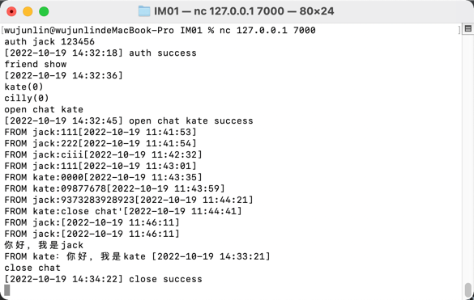

基于netty开发命令行IM

基本命令
认证：auth [username] [password]
添加朋友：friend add [username]
展示朋友：friend show
打开聊天室：open chat [username]
关闭聊天室：close chat
添加群组：group add [groupname] [username1] [username2]
展示群组：group show
打开群组聊天室：open group [groupname]
关闭聊天室：close chat

部署：nc 106.55.231.4 7000
测试账号：jack/123456、kate/123456

